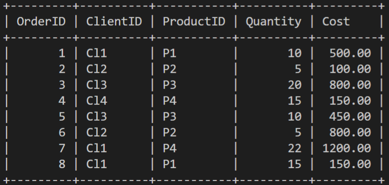
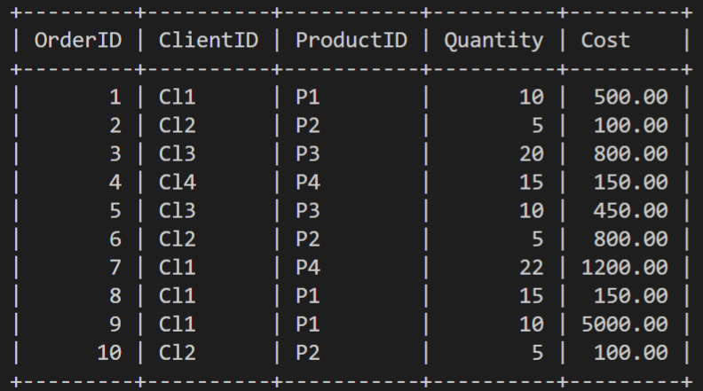
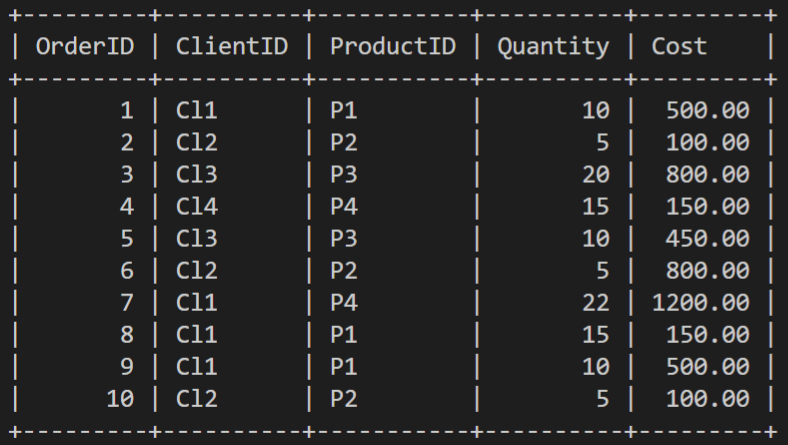

# MySQL Replace statement 
 
 
## Lab Instructions 

Lucky Shrub is a medium-sized garden design firm that sells indoor and outdoor plants, making them a one stop shop for clients.  In this lab, you must complete the following tasks to make it easier for Lucky Shrub to insert and update data in the Orders table using the REPLACE statement.   


The Orders table contains information about the Order ID, Client ID, Product ID, Quantity and Cost as shown below.  

 

**Note:** Before you begin, make sure you know how to access [MySQL environment](https://www.coursera.org/learn/database-structures-and-management-with-mysql/supplement/BSZK6/how-to-access-mysql-environment).

###  Prerequisites  

To complete this lab, you must have the Lucky Shrub database created in MySQL. You must also have created and populate the Orders table with relevant data inside the Lucky Shrub database.  

The code to create the database and the Orders table is as follows:  

1: Create database 

```SQL 

create database Lucky_Shrub; 

``` 

2: Use database 

```SQL 

use Lucky_Shrub; 

``` 

3: Create Orders table 

```SQL 

CREATE TABLE Orders (OrderID INT NOT NULL PRIMARY KEY, ClientID VARCHAR(10), ProductID VARCHAR(10), Quantity INT, Cost DECIMAL(6,2)); 

``` 

4: Insert data 

```SQL 

INSERT INTO Orders (OrderID, ClientID, ProductID, Quantity, Cost) VALUES (1, "Cl1", "P1", 10, 500), (2, "Cl2", "P2", 5, 100), (3, "Cl3", "P3", 20, 800), (4, "Cl4", "P4", 15, 150), (5, "Cl3", "P3", 10, 450), (6, "Cl2", "P2", 5, 800), (7, "Cl1", "P4", 22, 1200), (8, "Cl1", "P1", 15, 150);  

```   

 
## There are two main objectives in this activity:   

1. Insert new records of data using the REPLACE statement.  

2. Update records with new data using the REPLACE statement. 

 

## Tasks Instructions 

Please attempt the following tasks: 
 
**Task 1:** Write a SQL REPLACE statement that inserts two new orders with the following details: 

* Order 9 data: 

* OrderID = 9, ClientID = "Cl1", ProductID = "P1", Quantity = 10, Cost = 5000  

* Order 10 data: 

* OrderID = 10, ClientID = "Cl2", ProductID = "P2", Quantity = 5, Cost = 100 

 
Once you have executed the SQL statement, you can select all available data in the Orders table. The expected output result should be the same as the following screenshot (assuming that you have created and populated the tables correctly.)

 

 
**Task 2:** Lucky Shrub have noticed that the cost of order number 9 is 5000$. This is a mistake. The order must cost 500$. You must help them to change it to 500$ by writing a relevant REPLCACE statement. Once you have executed the SQL statement, select all available data from the Orders table. The expected output result should be the same as the following screenshot (assuming that you have created and populated the tables correctly.) 

 

 
